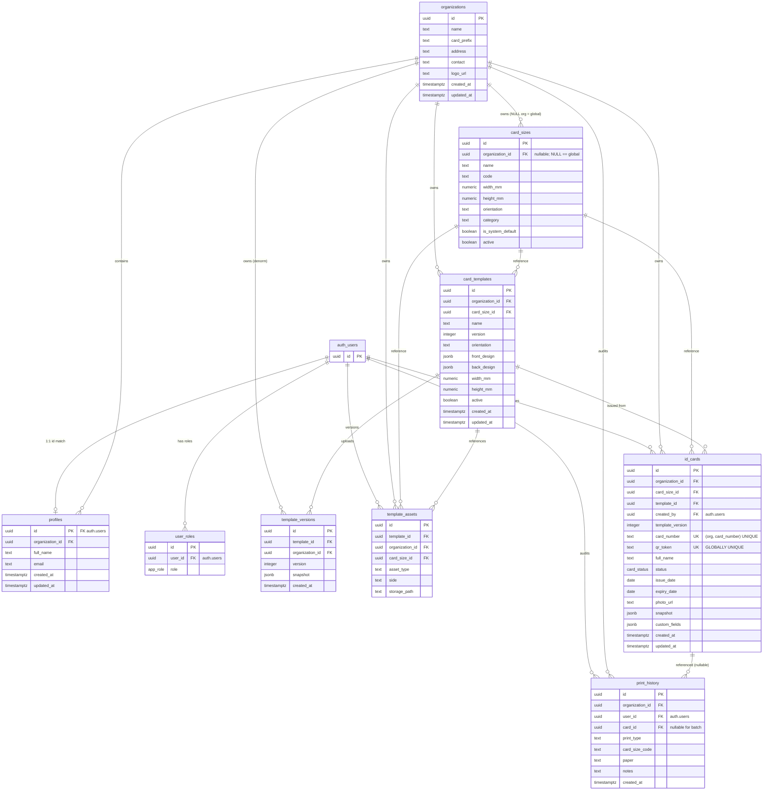

# RELATIONSHIP MODEL

## 1. Entity-Relationship Diagram (Mermaid)

## 2. Cardinality Summary

| Parent | → | Child | Rel | Notes |
|--------|---|-------|-----|-------|
| `auth.users` | → | `profiles` | **1:1** | Same primary key value; auto synced trigger |
| `auth.users` | → | `user_roles` | **1:N** | Multiple roles allowed |
| `auth.users` | → | `id_cards.created_by` | **1:N** | SET NULL on user deletion |
| `auth.users` | → | `print_history.user_id` | **1:N** | SET NULL |
| `auth.users` | → | `template_assets.created_by` | **1:N** | SET NULL |
| `organizations` | → | `profiles` | **1:N** | N members per workspace |
| `organizations` | → | `card_sizes` | **1:N (nullable)** | NULL org ⇒ global system size |
| `organizations` | → | `card_templates` | **1:N** | Strict tenant isolation |
| `organizations` | → | `template_versions` | **1:N** | Denormalised tenant key for RLS shortcut |
| `organizations` | → | `template_assets` | **1:N** | |
| `organizations` | → | `id_cards` | **1:N** | |
| `organizations` | → | `print_history` | **1:N** | |
| `card_sizes` | → | `card_templates` | **1:N** | |
| `card_sizes` | → | `id_cards` | **1:N** | |
| `card_sizes` | → | `template_assets` | **1:N** | |
| `card_templates` | → | `template_versions` | **1:N** | Unique(template_id, version) |
| `card_templates` | → | `template_assets` | **1:N (nullable)** | NULL ⇒ shared org background gallery |
| `card_templates` | → | `id_cards` | **1:N** | SET NULL delete, blocks physical delete if UI catches FK |
| `id_cards` | → | `print_history` | **1:N (nullable)** | NULL = batch sheet (multiple cards printed together) |

## 3. Tenant Isolation Edges

Every N-child relation that is not globally shared flows through exactly one `organization_id` predicate applied in:
- `current_org_id()` resolver (STABLE SECURITY DEFINER)
- Each RLS USING / WITH CHECK clause (see `011_rls.sql`)

Global exceptions:
- `card_sizes` rows where `organization_id IS NULL AND is_system_default = TRUE` are readable by every org because the templates/cards picker needs the 5 seeded ISO sizes. Custom sizes remain org-gated.
- `template_assets` rows where `template_id IS NULL AND asset_type='BACKGROUND'` form a shared background gallery (predicate in template_assets RLS). Still limited by organization_id.

## 4. Deletion Behaviour

| FK | `ON DELETE` | Rationale |
|----|-------------|-----------|
| `profiles.id → auth.users` | CASCADE | If user is deleted, wipe their profile row |
| `user_roles.user_id → auth.users` | CASCADE | Same user — drop roles |
| `profiles.organization_id → orgs` | SET NULL | Preserve profile row; UI handles orphan gracefully |
| `card_templates.organization_id → orgs` | CASCADE | Tenant wipe |
| `id_cards.organization_id → orgs` | CASCADE | Tenant wipe |
| `template_versions.organization_id → orgs` | CASCADE | Tenant wipe |
| `template_assets.organization_id → orgs` | CASCADE | Tenant wipe |
| `print_history.organization_id → orgs` | CASCADE | Tenant wipe |
| `id_cards.card_size_id → sizes` | SET NULL | If a size is deleted, existing cards keep working (size code denormalised onto cards/history already) |
| `id_cards.template_id → templates` | SET NULL | UI `templates.tsx:200` already catches the error and warns "Cards were issued from this template, so it can't be deleted."; DB SET NULL provides a safe fallback if delete somehow happens |
| `id_cards.created_by → auth.users` | SET NULL | Retain historical records |
| `print_history.card_id → id_cards` | SET NULL | Retain audit even if card is deleted |
| `print_history.user_id → auth.users` | SET NULL | |
| `template_assets.created_by → auth.users` | SET NULL | |
